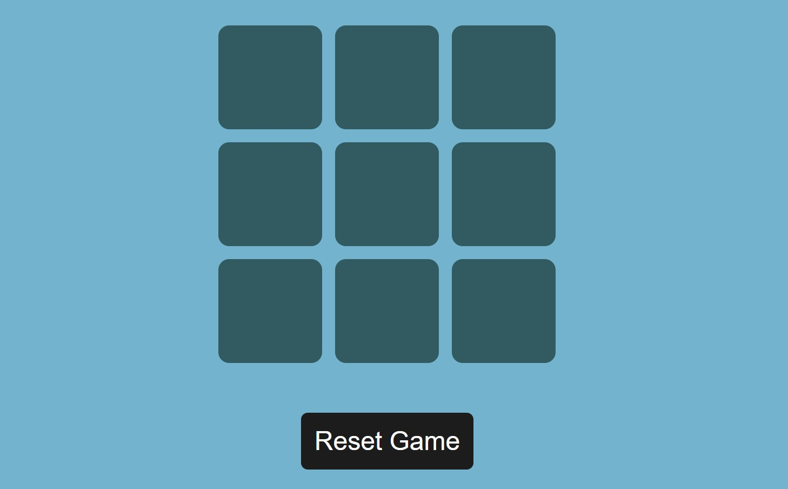

# Tic Tac Toe Game

## Description
This is a simple Tic Tac Toe Game built using HTML, CSS, JavaScript

## Features
- Multiplayer game
- altenate turns
- user can tap on the box they want, in their turn
- user can reset the game by tapping on reset game button
- after finishing a game a new game can be started by tapping on the new game button

## Technologies used
- HTML
- CSS
- JavaScript
- Git(for version-control)

## Tools Used
- VScode
- GitHub(for hosting the repository remotely)
- Vercel(for domain and hosting)

## How to Play
- user can tap on the box they want, in their turn
- user can reset the game by tapping on reset game button
- after finishing a game a new game can be started by tapping on the new game button

## Screenshot


## Live Demo
[Click here](https://tic-tac-toe-game-cyan-pi.vercel.app/)

## Project Structure
```

Project/
|--index.html
|--scripts/
  |--script.js
|--styles/
  |--style.css

```
